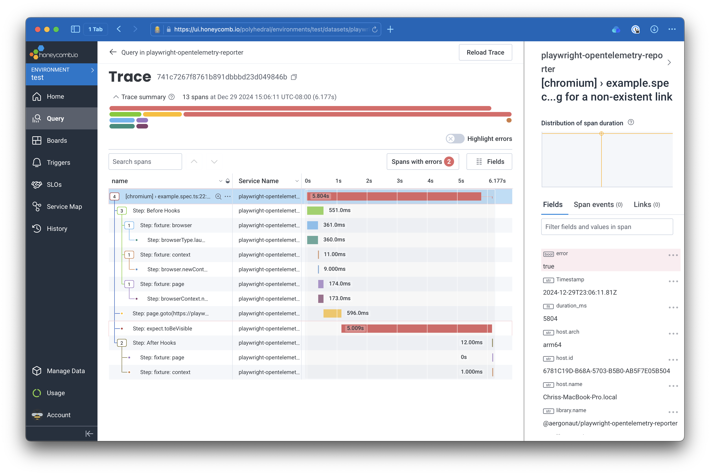

TLDR: I've released [`playwright-opentelemetry-reporter`](https://github.com/aergonaut/playwright-opentelemetry-reporter), a reporter for [Playwright](https://playwright.dev) that generates OpenTelemetry traces from Playwright tests. Give it a try if you would like to have more visibility into the performance of your tests!



## The Problem

I have always had a complicated relationship with end-to-end (e2e) tests.

On the one hand, when they work, I really value them for the high level of confidence they can give you that your whole app is behaving as you expect, by driving a real browser and interacting with the app as much like a real user as possible. On the other hand, when they fail or start slowing down, I dread having to debug what went wrong or what's causing the test to slow down. It's much harder to debug what's happening, especially as test scenarios get longer and more complex.

I've been thinking a lot about [OpenTelemetry](https://opentelemetry.io) recently, and wondered if it could be applied to e2e tests. Wouldn't it be nice to be able to see a trace of the performance of your tests, and be able to query the spans the same way you can query traces in production?

## Playwright Reporters

I've been using Playwright for my e2e tests recently, so I decided to look at integrating OpenTelemetry with Playwright first. I've never created an OpenTelemetry instrumentation package before, and learning how to make one seemed too complex for what I wanted to do.

I knew that Playwright already had an API to create custom reports from test runs, and the built-in reports included at least some information about the runtime of each test. So instead of figuring out how to instrument Playwright itself, I decided to try to implement a reporter that would use the built-in test reports to generate OpenTelemetry spans.

## Creating a Custom Reporter

Playwright has [documentation](https://playwright.dev/docs/test-reporters#custom-reporters) showing how to get started with a custom reporter. All you need is a module which exports a single class that responds to a few callback hooks:

```ts
class OpenTelemetryReporter implements Reporter {
  onBegin(config: FullConfig, suite: Suite): void {}

  onTestBegin(test: TestCase, result: TestResult): void {}

  onTestEnd(test: TestCase, result: TestResult): void {}

  onStepBegin(test: TestCase, result: TestResult, step: TestStep): void {}

  onStepEnd(test: TestCase, result: TestResult, step: TestStep): void {}
}
```

Each of these callback functions is called at either the beginning or end of the whole test suite, an individual `test`, or each step within a test.

### Generating Spans for Tests

The usual way to generate a span with OpenTelemetry is using the `startActiveSpan` function. This is what the documentation [recommends](https://opentelemetry.io/docs/languages/js/instrumentation/#create-spans). However, to use `startActiveSpan`, you need to also pass it a function which will be wrapped in a new context with the new span activated inside. However, Playwright reporters do not have access to the test run itself, so we can't pass a function to `startActiveSpan`. Instead, we have to use `startSpan` and manage the spans directly. For test spans, this is no big deal, because I want each test span to be a "root" span, meaning they have no parent, so we don't need to do anything special to manage nesting.

One thing we do need to be careful about, however, is ensuring that we close the spans when the test ends. This is a benefit of `startActiveSpan` that we lose out on by managing the spans manually. To ensure we close the correct span when Playwright calls `onTestEnd`, we store each span in a hash, using the `test.id` as the key. Additionally, when ending the span, we explicitly calculate the end time by adding the duration to the start time, to ensure that the span duration matches the test duration in Playwright.

```ts
onTestBegin(test: TestCase, result: TestResult): void {
  // Create the new span
  const testSpan = this.tracer.startSpan(formatTestTitle(this.config, test), {
    startTime: result.startTime,
  });
  // Store it
  this.testSpans[test.id] = testSpan;
}

onTestEnd(test: TestCase, result: TestResult): void {
  // Fetch the span by the test.id
  const testSpan = this.testSpans[test.id];
  if (testSpan) {
    // ...
    // End the span
    testSpan.end(result.startTime.getTime() + result.duration);
  }
}
```

### Generating Spans for Steps

Steps in Playwright can encompass several different kinds of work, and give a lot of information about what specifically each test is doing. Steps are generated for before hooks, fixture setup, locators, and expectations. Tracking all of these as spans gives pretty good visibility into how each test is performing.

As with test cases, we have to use `startSpan` to manually manage the spans, as we do not have access to the test execution itself. An additional complication is that we potentially need to nest steps, if Playwright reports that a step has a `parent`. This is crucial information to preserve as it can help understand why a before hook or fixture setup is taking longer than expected. To preserve the nesting, we need to manually create a new context with the correct parent step and pass that context into `startSpan`.

```ts
onStepBegin(test: TestCase, _result: TestResult, step: TestStep): void {
  // Find the parent step if it exists, or use the test.id
  const parent =
    step.parent === undefined
      ? this.testSpans[test.id]
      : this.stepSapns[getHashFromStepTitle(test, step.parent, this.config)];

  const stepHash = getHashFromStepTitle(test, step, this.config);

  // Create a new context with the parent
  const ctx = opentelemetry.trace.setSpan(
    opentelemetry.context.active(),
    parent
  );

  // Start the new span using the context
  const stepSpan = this.tracer.startSpan(
    `Step: ${step.title}`,
    {
      startTime: step.startTime,
    },
    ctx
  );

  // Store the span
  this.stepSapns[stepHash] = stepSpan;
}
```

Ending the span is much the same as it was for test cases.

### Attaching Span Attributes

The final piece that I wanted to handle was allowing annotating the spans with custom attributes. Usually, this would be done by calling `setAttributes` on the current span in the application code. However, the Playwright test code won't have access to the spans at runtime, because they are generated separately by the reporter.

The solution was to use [Playwright annotations](https://playwright.dev/docs/test-annotations). This API allows tests to attach arbitrary data to the test run at runtime. To convert these annotations to span attributes simply required adding some code in the `onTestEnd` function to read the annotations and convert them to attributes:

```ts
test.annotations.forEach((annotation) => {
  if (annotation.type.startsWith(TEST_ANNOTATION_SCOPE)) {
    const attrLabel = annotation.type.replace(TEST_ANNOTATION_SCOPE, '');
    testSpan.setAttribute(attrLabel, annotation.description);
  }
});
```

In addition to custom attributes, there were several standard attributes that I wanted to attach as well. These all come from data in the `TestCase`, `TestStep`, and `TestResult` objects, and include information like the file location, test case name, etc. I leveraged [Semantic Conventions](https://opentelemetry.io/docs/specs/semconv/) for these attributes, where possible.

## Conclusion

I have been testing out this reporter for myself on some side projects and have really appreciated being able to see traces for my test runs. Being able to see more clearly the internal workings of my e2e tests has given me increased confidence in them.

Cover image by [Rob Laughter](https://unsplash.com/@roblaughter?utm_source=unsplash&utm_medium=referral&utm_content=creditCopyText) on [Unsplash](https://unsplash.com/photos/red-theater-curtain-WW1jsInXgwM?utm_source=unsplash&utm_medium=referral&utm_content=creditCopyText)