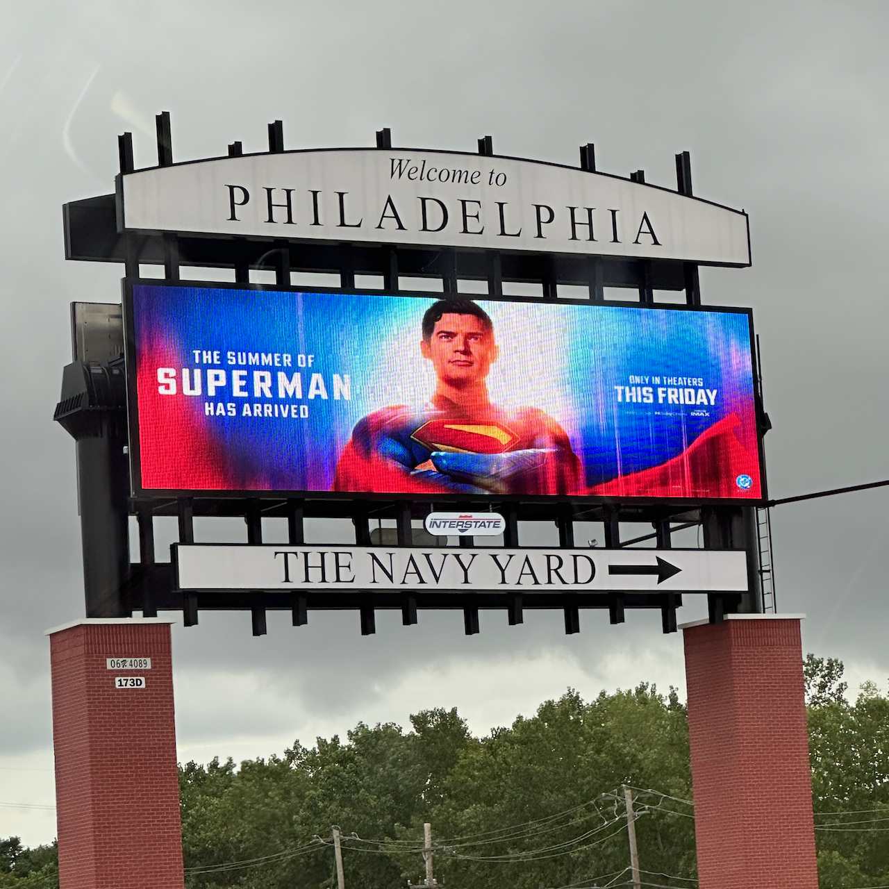
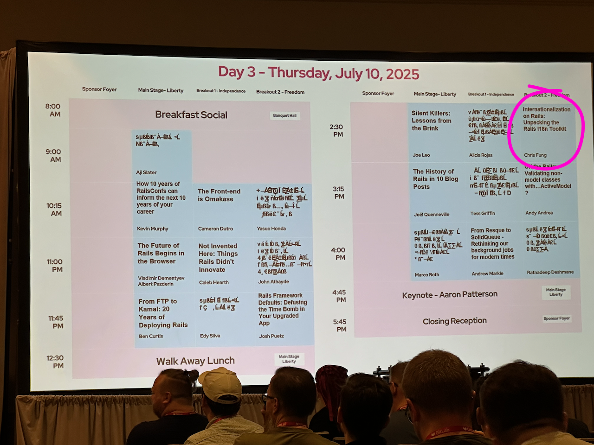
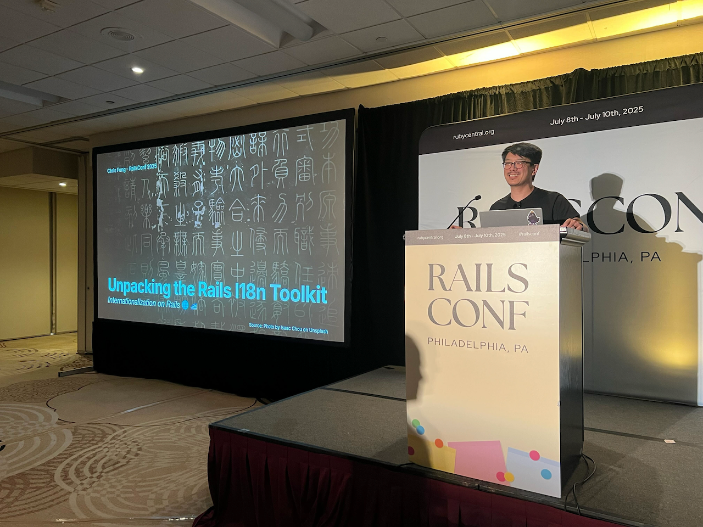
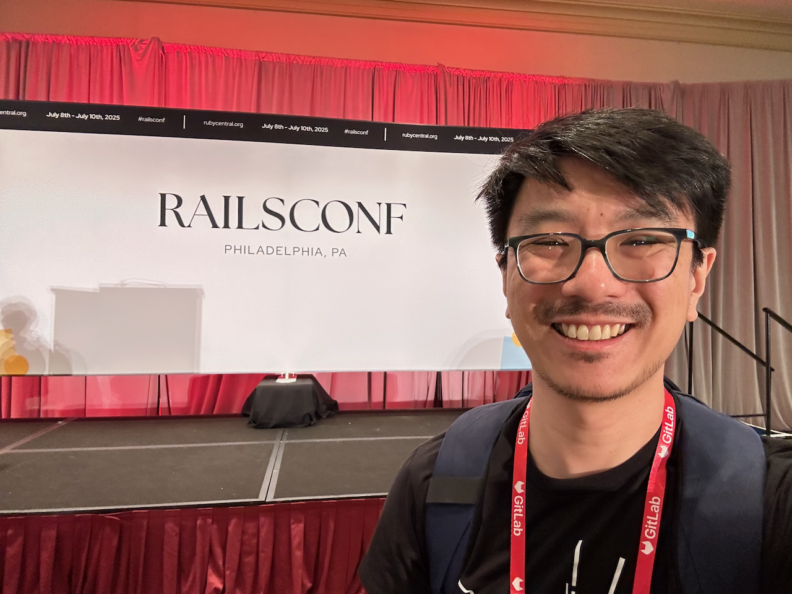

Last week, I had the incredible opportunity to check off two major career bucket list goals:

1. Speak at a a major conference
2. Speak at RailsConf

While I was relatively confident I would be able to achieve both of these _at some point_, I never imagined my first public speaking appearance would _also_ be at RailsConf; and not only that, not just any RailsConf, but the very last RailsConf, closing out a chapter in the history of the Rails community!

But, flying into Philadelphia last Monday, it finally sunk in that that was exactly what was happening.

In this post, I want to do a brief retrospective on how I got to this point, in the hope that it could maybe inspire someone else to take a similar tack.

## Beginnings

The first kernel of an idea that I might like to try public speaking entered my brain in 2014, when I gave a presentation to my team at `$DAYJOB` about how to work with the Rails schema and migrations.

That talk was not recorded, and the slides are lost to the digital void, but I was able to uncover the title slide, which I'm still quite proud of. (The photo is of a flock of geese. Because geese migrate. And the topic is migrations.)

I don't know what possessed me to volunteer to give this talk. I am quite the introvert and quickly tire out when faced with groups of more than a handful of people. But at the same time, if I feel like I have uncovered some novel fundamental truth about some complex domain, I quite enjoy sharing that with others, so as to better enlighten them. Perhaps it was that impulse, to share what I know with others, and thereby illuminate for them a path through the fog of complexity, which won out.

After that first presentation, I gave several other talks on various topics to internal audiences of various sizes at `$DAYJOB`, including Rails test libraries, and how to choose what kind of test to write; using Sorbet and the VS Code Sorbet extension to quickly catch common errors like methods defined in the wrong scope, or methods called on a potential `nil` value; and how to give a good code review and create a positive code review environment. These all helped me not only to build up confidence speaking to a group, but also to get used to process of finding an idea, writing, editing, and creating slides that are more than just my speaker notes on screen.

## SF Ruby meetup ☁️ 🌉 💎

I'm not sure where I heard this piece of advice from first, but I had heard that a good way for new speakers to try out speaking is by going to local meetups or local conferences. For a long time, I was very dismayed that the Ruby meetup groups in the Bay Area had fallen dormant. Even GoGaRuCo, the local Bay Area Ruby conference, had faded away.

So when [Irina Nazarova](https://bsky.app/profile/inazarova.bsky.social) begin to revive the [SF Ruby meetup](https://lu.ma/sfruby) in March 2024, I was very excited. Finally, a venue to practice speaking to strangers, that was not nearly as intimidating as getting up on a big stage at a large conference!

Meeting people at the meetups also helped greatly to calm my anxiety by making the audience feel less like strangers. Of course, it helps that the Ruby community seems to be universally welcoming, open, friendly, and kind.

I made my first submission to the meetup CFP in fall of 2024, and gave [my first talk](https://www.rubyevents.org/talks/how-to-translate-your-rails-app-into-over-20-languages-and-why-you-should) there in November! I was really happy that people seemed to enjoy my talk and want to engage with it and ask questions afterwards. It was also really great to get support and encouragement--before, during, and after--from people I had met at the meetup.

I will say that that advice is correct. Speaking at a meetup is a lot like speaking at a conference, just on a much smaller scale. There are fewer people in the audience, fewer speakers each night, and more events and therefore opportunities to speak. You don't need to have something as polished as what a conference might expect; and organizers don't have to be as selective, since the next meetup is always just around the corner. If you've been going to the meetup regularly, you probably already know some people in the audience, which also helps to take the pressure off of speaking to a crowd of strangers. I really recommend anyone who has even the slightest interest in public speaking to try speaking at a meetup as a first go.

## RailsConf 2025

Like I said at the beginning of this post, speaking at a conference and speaking at RailsConf have been two big career goals of mine for a long time. I had some concept of a plan to start by speaking at some smaller regional conferences and gradually work my way up to RailsConf. But when Ruby Central announced that 2025 would be the last year of RailsConf, and the conference would be retiring afterwards, I knew I would regret it if I didn't do something.

Luckily, I already had a topic and talk that I was reasonably happy with and fit the time slot. I attended the CFP coaching session, where I got a lot of really good tips on how to make a good proposal. Big thanks to the coach in my session, [Kevin Murphy](https://kevinjmurphy.com/posts/railsconf-2025-recap/), as well as Aji and Sage, for all their incredible knowledge and support. I don't think my proposal would have been half as good without what I learned in that session, and I certainly don't think I would have been chosen!

Fast-forward to last Thursday, the last day of the last RailsConf, and my name is up on the big screen alongside some of the people I look up to most in the Ruby community, including Aji Slater, Joël Quenneville, and Aaron Patterson!

Giving [my talk](https://speakerdeck.com/aergonaut/unpacking-the-rails-i18n-toolkit) was surprisingly the easiest part. You have a time limit, but that also means you know that it's going to end at some point, and the discomfort won't drag on forever. The stage lights are pretty bright, but this also means that you can't really see people in the audience, so it's easier to pretend they're not all staring at you. And the tech crew is there to make sure your mic is setup correctly and your laptop projects on screen like you expect. Big thanks to them in particular for making my first conference talk go so smoothly.

I even had some really great conversations with people who came up to ask me questions after I was done! This was particularly heartening to me, since I could tell people not only enjoyed the talk, but also found the content useful and learned some new things!

## Wrapping up

Speaking at RailsConf was such a fulfilling experience. I definitely feel like I unwittingly did an any% speedrun of Ruby conference speaking. But through this whole journey I've made so many valuable connections, developed new skills, honed others, and increased my confidence.

While I wouldn't recommend jumping from local meetups to an 800-person conference in less than a year, I do recommend speaking at a conference to anyone who likes teaching, telling stories, or just sharing cool things they've learned. If you're new to public speaking, internal lightning talks or lunch and learn sessions can be a good, low risk way to try it out. Move on to a local meetup when you feel more comfortable. Meetup talks can be graduated to conference talks with a bit of cleanup and expansion.

Thank you RailsConf, the program committee, Ruby Central, and everyone I met last week! I couldn't have asked for a better first-time speaker experience than this!

